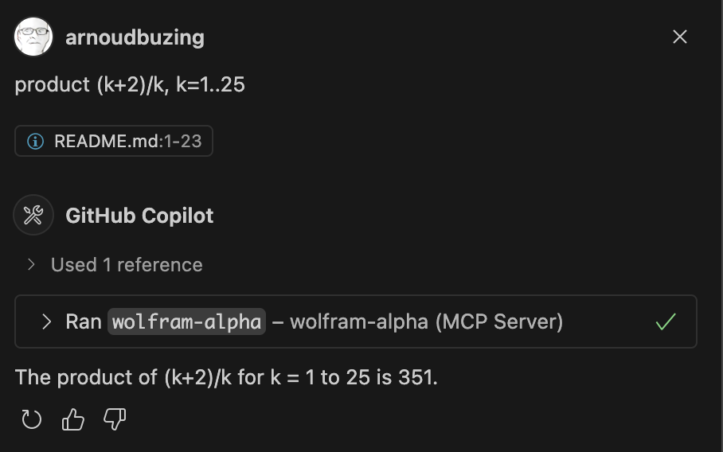

# Wolfram MCP Server

This is a simple server that acts as a bridge between the Wolfram Alpha API and the MCP (Model Context Protocol) used by various clients like VS Code, Cursor, and Claude. It allows you to send queries to Wolfram Alpha and receive responses in a format that can be used by these clients.

Requirements: You need to have Node.js and npm installed on your system.

1. Clone the repository:

```
git clone git@github.com:arnoudbuzing/wolfram-mcp-server.git
```

2. Change to the project directory:

```
cd wolfram-mcp-server
```

3. Install the dependencies:

```
npm install
```

4. Get a Wolfram Alpha API key from https://developer.wolframalpha.com/access

4. Configure your MSP client (e.g. VS Code or Claude) by providing the MSP server configuration. See `config.json` for an example configuration that works with this server. You will need to set the path to the `server.js` file and also set the Wolfram Alpha API key.

Example from VS Code with Copilot:

